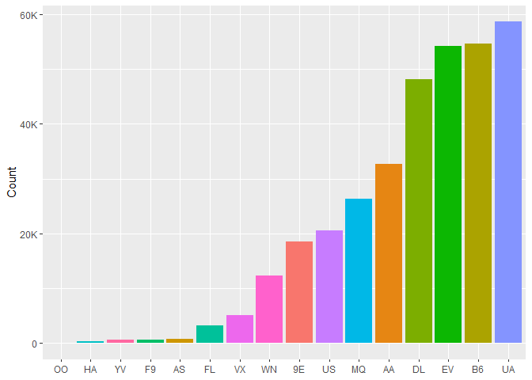

nycflights13
================
Jan Moskal
2023-08-19

``` r
# Loading libraries and data

library(tidyverse)
```

    ## ── Attaching core tidyverse packages ──────────────────────── tidyverse 2.0.0 ──
    ## ✔ dplyr     1.1.3     ✔ readr     2.1.4
    ## ✔ forcats   1.0.0     ✔ stringr   1.5.0
    ## ✔ ggplot2   3.4.3     ✔ tibble    3.2.1
    ## ✔ lubridate 1.9.3     ✔ tidyr     1.3.0
    ## ✔ purrr     1.0.2     
    ## ── Conflicts ────────────────────────────────────────── tidyverse_conflicts() ──
    ## ✖ dplyr::filter() masks stats::filter()
    ## ✖ dplyr::lag()    masks stats::lag()
    ## ℹ Use the conflicted package (<http://conflicted.r-lib.org/>) to force all conflicts to become errors

``` r
library(nycflights13)
library(ggthemes)
library(gganimate)
library(scales)
```

    ## 
    ## Attaching package: 'scales'
    ## 
    ## The following object is masked from 'package:purrr':
    ## 
    ##     discard
    ## 
    ## The following object is masked from 'package:readr':
    ## 
    ##     col_factor

``` r
library(patchwork)
library(extrafont)
```

    ## Registering fonts with R

``` r
library(plotly)
```

    ## 
    ## Attaching package: 'plotly'
    ## 
    ## The following object is masked from 'package:ggplot2':
    ## 
    ##     last_plot
    ## 
    ## The following object is masked from 'package:stats':
    ## 
    ##     filter
    ## 
    ## The following object is masked from 'package:graphics':
    ## 
    ##     layout

``` r
flights_df <- nycflights13::flights
weather_df <- nycflights13::weather
planes_df <- nycflights13::planes

flights_and_wheter_df <- left_join(flights, weather, by = c("origin", "year", "month", "day", "hour"))
flights_weather_planes <- left_join(flights_and_wheter_df, planes, by = "tailnum")
flights_weather_planes <- flights_weather_planes %>%
  select(-time_hour.y) %>%
  rename(built_year = year.y)
```

What is the average departure and arrival delay?

``` r
flights %>% 
  summarise(avg_dep_delay = mean(dep_delay, na.rm = TRUE),
            avg_arr_delay = mean(arr_delay, na.rm = TRUE), 
            median_dep_delay = median(dep_delay, na.rm = TRUE),
            median_arr_delay = median(arr_delay, na.rm = TRUE))
```

    ## # A tibble: 1 × 4
    ##   avg_dep_delay avg_arr_delay median_dep_delay median_arr_delay
    ##           <dbl>         <dbl>            <dbl>            <dbl>
    ## 1          12.6          6.90               -2               -5

Is there any relationship between delay and time of day, day of the
week, or month?

``` r
# ------------------------------------------------------------------------------------------------

flights %>%
  group_by(hour = sched_dep_time %/% 100) %>%
  summarize(avg_delay = mean(arr_delay, na.rm = TRUE)) %>%
  ggplot(aes(x = hour, y = avg_delay)) +
  geom_histogram(stat = "identity")
```

    ## Warning in geom_histogram(stat = "identity"): Ignoring unknown parameters:
    ## `binwidth`, `bins`, and `pad`

    ## Warning: Removed 1 rows containing missing values (`position_stack()`).

<!-- -->

``` r
# Late night and early morning flights are less often delayed.

flights %>%
  group_by(month) %>%
  summarise(avg_month_delay = mean(arr_delay, na.rm = TRUE)) %>%
  ggplot(aes(x = month <- factor(month, labels = month.name), y = avg_month_delay, fill = as.factor(month))) +
  geom_bar(stat = "identity") +
  theme(
    legend.position = "none",
    plot.title = element_text(size = 15, color = "red", hjust = 0.5)
  ) +
  labs(
    title = "Average delay in each month",
    x = NULL,
    y = "Average delay"
  )
```

<!-- -->

``` r
# Flights are delayed most in holidays and December and least in autumn
```

Is there a correlation between route length and delay? How does
seasonality impact flight delays?

``` r
# ------------------------------------------------------------------------------------------------
flights %>%
  mutate(distance = cut(nycflights13::flights$distance,
    breaks = seq(0, 5000, by = 1000),
    labels = c("1000", "2000", "3000", "4000", "5000")
  )) %>%
  group_by(distance) %>%
  summarise(avg_arr_delay = mean(arr_delay, na.rm = TRUE)) %>%
  ggplot(aes(x = distance, y = avg_arr_delay)) +
  geom_bar(stat = "identity")
```

<!-- -->

``` r
flights %>%
  mutate(distance = cut(nycflights13::flights$distance,
    breaks = seq(0, 5000, by = 1000),
    labels = c("1000", "2000", "3000", "4000", "5000")
  )) %>%
  group_by(distance) %>%
  summarise(avg_dep_delay = mean(dep_delay, na.rm = TRUE)) %>%
  ggplot(aes(x = distance, y = avg_dep_delay)) +
  geom_bar(stat = "identity")
```

<!-- -->

``` r
# Long-distance flights often make up for the flight delay during the flight
# No significant relationship between dep_delay and distance
```

Which airlines have the highest number of flights?

``` r
flights %>% 
  group_by(carrier) %>% 
  count(sort = TRUE) %>% 
  ggplot(aes(x = fct_reorder(carrier, n), y = n, fill = carrier)) +
  geom_bar(stat= "identity") +
  theme(legend.position = "none") +
  labs(x = NULL, 
       y = "Count") +
  scale_y_continuous(labels = label_number_si())
```

    ## Warning: `label_number_si()` was deprecated in scales 1.2.0.
    ## ℹ Please use the `scale_cut` argument of `label_number()` instead.
    ## This warning is displayed once every 8 hours.
    ## Call `lifecycle::last_lifecycle_warnings()` to see where this warning was
    ## generated.

<!-- -->

Is there a relationship between the airline and delay?

``` r
# ------------------------------------------------------------------------------------------------

flights %>%
  group_by(carrier) %>%
  summarise(avg_delay = mean(arr_delay, na.rm = TRUE)) %>%
  ggplot(aes(x = reorder(carrier, avg_delay), y = avg_delay, fill = carrier)) +
  geom_bar(stat = "identity")
```

<!-- -->

``` r
# Flight delays depends on carriers
```

Is there a relationship between the origin and delay?

``` r
flights %>%
  group_by(origin) %>%
  summarize(avg_delay = mean(arr_delay, na.rm = TRUE)) %>%
  ggplot(aes(x = origin, y = avg_delay, fill = origin)) +
  geom_bar(stat = "identity") +
  theme(legend.position = "none")
```

<!-- -->

``` r
# Flight delay kinda depends on origin
```

What are the most popular flight routes in the dataset?

``` r
flights %>% 
  group_by(origin, dest) %>% 
  count(sort = TRUE)
```

    ## # A tibble: 224 × 3
    ## # Groups:   origin, dest [224]
    ##    origin dest      n
    ##    <chr>  <chr> <int>
    ##  1 JFK    LAX   11262
    ##  2 LGA    ATL   10263
    ##  3 LGA    ORD    8857
    ##  4 JFK    SFO    8204
    ##  5 LGA    CLT    6168
    ##  6 EWR    ORD    6100
    ##  7 JFK    BOS    5898
    ##  8 LGA    MIA    5781
    ##  9 JFK    MCO    5464
    ## 10 EWR    BOS    5327
    ## # ℹ 214 more rows

``` r
flights %>% 
  group_by(origin, dest) %>% 
  count(sort = TRUE) %>% 
  ungroup() %>% 
  mutate(x = row_number()) %>% 
  ggplot(aes(x = x, y = n)) +
  geom_histogram(stat = "identity")
```

    ## Warning in geom_histogram(stat = "identity"): Ignoring unknown parameters:
    ## `binwidth`, `bins`, and `pad`

<!-- -->

Which routes experience the most delays?

``` r
# Total dep_delay  for each route
flights %>% 
  group_by(origin, dest) %>% 
  summarise(total_delay = sum(dep_delay, na.rm = TRUE)) %>% 
  arrange(desc(total_delay))
```

    ## `summarise()` has grouped output by 'origin'. You can override using the
    ## `.groups` argument.

    ## # A tibble: 224 × 3
    ## # Groups:   origin [3]
    ##    origin dest  total_delay
    ##    <chr>  <chr>       <dbl>
    ##  1 LGA    ATL        115425
    ##  2 JFK    SFO         97271
    ##  3 JFK    LAX         95418
    ##  4 LGA    ORD         91812
    ##  5 EWR    ORD         85683
    ##  6 EWR    ATL         75819
    ##  7 EWR    SFO         72950
    ##  8 JFK    BOS         67667
    ##  9 EWR    BOS         65877
    ## 10 JFK    MCO         57609
    ## # ℹ 214 more rows

``` r
# Total arr_delay for each route
flights %>% 
  group_by(origin, dest) %>% 
  summarise(total_delay = sum(arr_delay, na.rm = TRUE)) %>% 
  arrange(desc(total_delay))
```

    ## `summarise()` has grouped output by 'origin'. You can override using the
    ## `.groups` argument.

    ## # A tibble: 224 × 3
    ## # Groups:   origin [3]
    ##    origin dest  total_delay
    ##    <chr>  <chr>       <dbl>
    ##  1 LGA    ATL        113689
    ##  2 EWR    ATL         64525
    ##  3 EWR    ORD         52436
    ##  4 LGA    CLT         43991
    ##  5 EWR    RIC         41700
    ##  6 EWR    STL         38671
    ##  7 EWR    CLT         38077
    ##  8 LGA    FLL         37940
    ##  9 EWR    CVG         37508
    ## 10 LGA    BNA         34952
    ## # ℹ 214 more rows

``` r
# Average dep_delay for each route
flights %>% 
  group_by(origin, dest) %>% 
  summarise(avg_delay = mean(dep_delay, na.rm = TRUE)) %>% 
  arrange(desc(avg_delay))
```

    ## `summarise()` has grouped output by 'origin'. You can override using the
    ## `.groups` argument.

    ## # A tibble: 224 × 3
    ## # Groups:   origin [3]
    ##    origin dest  avg_delay
    ##    <chr>  <chr>     <dbl>
    ##  1 EWR    TYS        41.8
    ##  2 EWR    CAE        36.3
    ##  3 EWR    TUL        34.9
    ##  4 LGA    SBN        31.3
    ##  5 EWR    OKC        30.6
    ##  6 LGA    BHM        29.8
    ##  7 LGA    CAE        29.5
    ##  8 EWR    DSM        29.3
    ##  9 EWR    JAC        28.7
    ## 10 EWR    ROC        27.9
    ## # ℹ 214 more rows

``` r
# Average arr_delay for each route
flights %>% 
  group_by(origin, dest) %>% 
  summarise(avg_delay = mean(arr_delay, na.rm = TRUE)) %>% 
  arrange(desc(avg_delay))
```

    ## `summarise()` has grouped output by 'origin'. You can override using the
    ## `.groups` argument.

    ## # A tibble: 224 × 3
    ## # Groups:   origin [3]
    ##    origin dest  avg_delay
    ##    <chr>  <chr>     <dbl>
    ##  1 EWR    CAE        44.6
    ##  2 EWR    TYS        41.2
    ##  3 EWR    TUL        33.7
    ##  4 EWR    OKC        30.6
    ##  5 EWR    JAC        29.9
    ##  6 EWR    RIC        25.8
    ##  7 EWR    MKE        24.0
    ##  8 EWR    DSM        23.5
    ##  9 EWR    MSN        23.2
    ## 10 EWR    PWM        23.0
    ## # ℹ 214 more rows

Which airport has the most flights?

``` r
flights %>% 
  count(origin, sort = TRUE)
```

    ## # A tibble: 3 × 2
    ##   origin      n
    ##   <chr>   <int>
    ## 1 EWR    120835
    ## 2 JFK    111279
    ## 3 LGA    104662

Are there airports where delays are more frequent?

``` r
flights %>% 
  mutate(delayed = arr_delay > 0) %>% 
  group_by(origin) %>% 
  summarise(prop_delayed = mean(delayed, na.rm = TRUE)) %>% 
  ggplot(aes(x = origin, y = prop_delayed, fill = origin)) +
  geom_bar(stat = "identity") +
  scale_y_continuous(name = "Proportion of delayed to all", labels = label_percent()) +
  theme(legend.position = "none") +
  labs(x = "Origin")
```

<!-- -->

``` r
flights %>% 
  group_by(origin) %>% 
  summarise(avg_delay = mean(arr_delay, na.rm = TRUE),
            total_delay = sum(arr_delay, na.rm = TRUE))
```

    ## # A tibble: 3 × 3
    ##   origin avg_delay total_delay
    ##   <chr>      <dbl>       <dbl>
    ## 1 EWR         9.11     1066682
    ## 2 JFK         5.55      605550
    ## 3 LGA         5.78      584942

Which airports are busiest at different times of the day?

``` r
flights %>% 
  group_by(hour) %>% 
  ggplot(aes(x = hour)) +
  geom_bar(aes(fill = origin)) +
    facet_wrap(~ origin) +
  theme(legend.position = "none")
```

<!-- -->

What are the most commonly used aircraft types in the area?

``` r
planes_df <- planes %>% 
  select(tailnum, type)
flights_and_planes <- left_join(flights, planes_df, by = "tailnum")

flights_and_planes %>% 
  count(type, sort = TRUE)
```

    ## # A tibble: 4 × 2
    ##   type                          n
    ##   <chr>                     <int>
    ## 1 Fixed wing multi engine  282074
    ## 2 <NA>                      52606
    ## 3 Fixed wing single engine   1686
    ## 4 Rotorcraft                  410

Do different aircraft types have different delay rates?

``` r
flights_and_planes %>% 
  drop_na(type) %>% 
  group_by(type) %>% 
  summarise(avg_arr_delay = mean(arr_delay, na.rm = TRUE),
            avg_dep_delay = mean(dep_delay, na.rm = TRUE))
```

    ## # A tibble: 3 × 3
    ##   type                     avg_arr_delay avg_dep_delay
    ##   <chr>                            <dbl>         <dbl>
    ## 1 Fixed wing multi engine           7.05          13.2
    ## 2 Fixed wing single engine          6.26          10.5
    ## 3 Rotorcraft                        9.28          14.2

Does the age of aircraft impact their performance?

``` r
 planes_df1 <- planes %>% 
  select(tailnum, type, year) %>% 
  rename(plane_year = year)
flights_and_planes1 <- left_join(flights, planes_df1, by = "tailnum")


flights_and_planes1 %>% 
  mutate(speed = distance / (air_time/ 60)) %>% 
  group_by(plane_year) %>% 
  summarise(avg_delay = mean(arr_delay, na.rm = TRUE),
            avg_speed = mean(speed, na.rm = TRUE)) %>% 
  arrange(desc(avg_delay))
```

    ## # A tibble: 47 × 3
    ##    plane_year avg_delay avg_speed
    ##         <int>     <dbl>     <dbl>
    ##  1       1983     14.0       398.
    ##  2       2004     10.2       395.
    ##  3       2002      9.94      385.
    ##  4       2006      9.90      390.
    ##  5       2005      9.80      389.
    ##  6       2003      9.65      392.
    ##  7       1974      8.14      314.
    ##  8       2001      7.93      395.
    ##  9       2007      7.54      372.
    ## 10       2000      7.26      380.
    ## # ℹ 37 more rows

What were the weather conditions on different quarters, and what impact
did they have on flight delays? Was there a correlation between delays
and specific weather variables such as precipitation, wind, or
visibility?

``` r
weather %>% 
  group_by(quarter = case_when(
   month %in% c(12, 1, 2) ~ "Winter",
   month %in% c(9, 10, 11) ~ "Autumn",
   month %in% c(8, 7, 6) ~ "Summer",
   month %in% c(3, 4, 5) ~ "Spring",
  )) %>% 
  summarise(avg_visiblity = mean(visib, na.rm = TRUE)) %>% 
  arrange(desc(avg_visiblity))
```

    ## # A tibble: 4 × 2
    ##   quarter avg_visiblity
    ##   <chr>           <dbl>
    ## 1 Autumn           9.57
    ## 2 Summer           9.54
    ## 3 Spring           9.25
    ## 4 Winter           8.65

``` r
weather %>% 
  group_by(quarter = case_when(
   month %in% c(12, 1, 2) ~ "Winter",
   month %in% c(9, 10, 11) ~ "Autumn",
   month %in% c(8, 7, 6) ~ "Summer",
   month %in% c(3, 4, 5) ~ "Spring",
  )) %>% 
  summarise(avg_precip = mean(precip, na.rm = TRUE),
            total_precip = sum(precip, na.rm = TRUE)) %>% 
  arrange(desc(avg_precip))
```

    ## # A tibble: 4 × 3
    ##   quarter avg_precip total_precip
    ##   <chr>        <dbl>        <dbl>
    ## 1 Summer     0.00650         42.9
    ## 2 Winter     0.00497         31.7
    ## 3 Spring     0.00389         25.8
    ## 4 Autumn     0.00250         16.3

``` r
weather %>% 
  group_by(quarter = case_when(
   month %in% c(12, 1, 2) ~ "Winter",
   month %in% c(9, 10, 11) ~ "Autumn",
   month %in% c(8, 7, 6) ~ "Summer",
   month %in% c(3, 4, 5) ~ "Spring",
  )) %>% 
  summarise(avg_wind_speed = mean(wind_speed, na.rm = TRUE)) %>% 
  arrange(desc(avg_wind_speed))
```

    ## # A tibble: 4 × 2
    ##   quarter avg_wind_speed
    ##   <chr>            <dbl>
    ## 1 Winter           11.3 
    ## 2 Spring           11.2 
    ## 3 Autumn           10.1 
    ## 4 Summer            9.48

``` r
# Visibilty is worst at Winter, rainfall are largest at Summer, windspeed is lowest at Summer

weather_df <- weather %>% 
  select(origin:hour, wind_speed, precip, visib)

flights_weather <- left_join(flights, weather_df, by = c("origin", "year", "month", "day", "hour"))

flights_weather %>% 
  ggplot(aes(x = precip, y = arr_delay)) +
  geom_point()
```

    ## Warning: Removed 10957 rows containing missing values (`geom_point()`).

<!-- -->

``` r
# I can not see relationship between precip and delay of flight

flights_weather %>% 
  drop_na(visib) %>% 
  group_by(visib) %>% 
  summarise(avg_delay = mean(dep_delay, na.rm = TRUE)) %>% 
  ggplot(aes(x = as.factor(visib), y = avg_delay)) +
  geom_bar(stat = "identity")
```

<!-- -->

``` r
flights_weather %>% 
  drop_na(precip) %>% 
  group_by(precip) %>% 
  summarise(avg_delay = median(dep_delay, na.rm = TRUE)) %>% 
  ggplot(aes(x = precip, y = avg_delay)) +
  geom_histogram(stat = "identity") 
```

    ## Warning in geom_histogram(stat = "identity"): Ignoring unknown parameters:
    ## `binwidth`, `bins`, and `pad`

<!-- -->

``` r
flights_weather %>% 
  drop_na(wind_speed) %>% 
  group_by(wind_speed) %>% 
  summarise(avg_delay = mean(dep_delay, na.rm = TRUE)) %>% 
  ggplot(aes(x = wind_speed, y = avg_delay)) +
  geom_histogram(stat = "identity") 
```

    ## Warning in geom_histogram(stat = "identity"): Ignoring unknown parameters:
    ## `binwidth`, `bins`, and `pad`

<!-- -->
